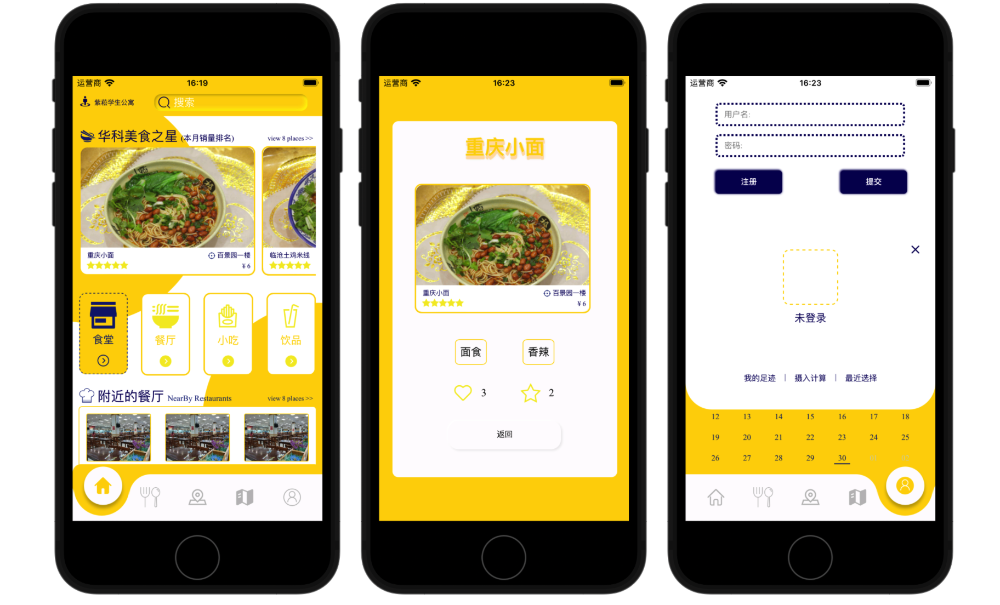

# :rice:HUSTFOOD — 美食推荐应用

本科大创项目，基于 **uni-app**（前端）+ **Django**（后端）+ **SQLite/Redis**（数据库） 框架实现的跨平台App 。推荐算法基于新老用户，对新用户采用基于规则的冷启动推荐（距离用户宿舍最近的食堂与用户最爱的口味），对老用户则做基于用户的协同过滤推荐。目前在尝试结合不同推荐算法，对其中美食推荐功能做进一步优化...

##### 前端页面

  

